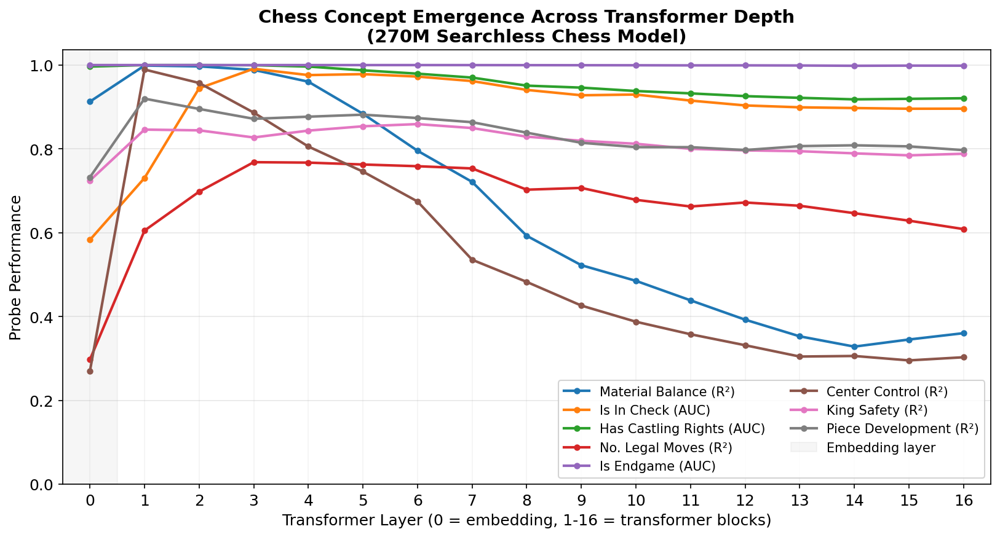
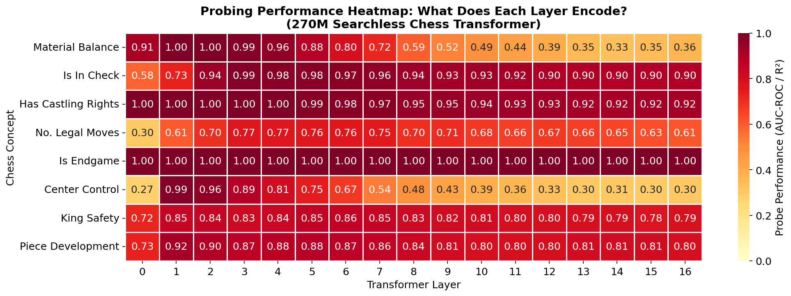
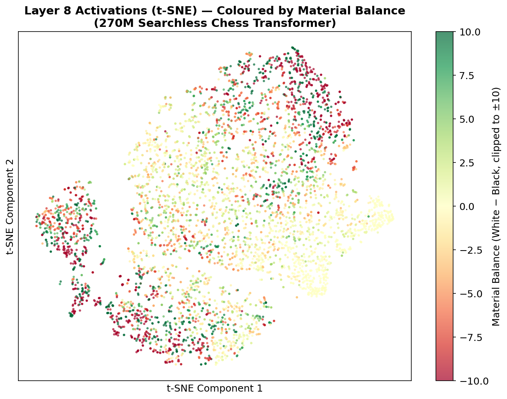
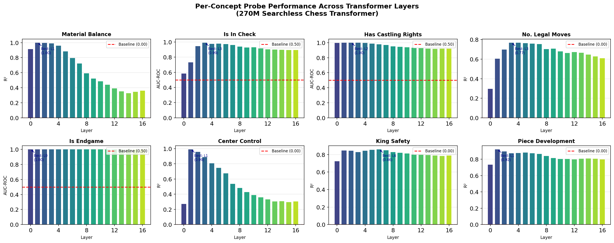

# Mechanistic Interpretability of a 270M Chess Transformer

A probing framework that reveals what chess concepts each layer of DeepMind's 270M-parameter Searchless Chess transformer has learned internally.

## Research Question

> *When the transformer looks at a chess position, what does each layer "understand"?*
> *Does it learn material balance? Tactical threats? King safety?*
> *At which depth does each concept emerge — and does it persist?*

## Approach

I use **linear probing classifiers** — the standard method from mechanistic interpretability research (Conneau et al., 2018; Alain & Bengio, 2017). For each of 8 chess concepts across all 17 layers (embedding + 16 transformer blocks):

1. **Extract activations** — run 5,488 diverse chess positions through the model and capture the hidden state at every layer
2. **Mean-pool** — compress each position's 77-token sequence into a single 1024-dim vector per layer
3. **Train a linear probe** — fit a logistic regression (binary concepts) or Ridge regression (continuous concepts) to predict the chess concept from the activation vector
4. **Measure** — if the probe succeeds, the concept is linearly encoded in that layer's representation

## Key Results

| Concept | Metric | Best Score | Best Layer |
|---------|--------|-----------|------------|
| Material Balance | R² | **0.999** | Layer 1 |
| Is In Check | AUC-ROC | **0.991** | Layer 3 |
| Has Castling Rights | AUC-ROC | **1.000** | Layer 2 |
| No. Legal Moves | R² | **0.768** | Layer 3 |
| Is Endgame | AUC-ROC | **1.000** | Layer 0 |
| Center Control | R² | **0.989** | Layer 1 |
| King Safety | R² | **0.859** | Layer 6 |
| Piece Development | R² | **0.920** | Layer 1 |

### Main Finding: Concept Emergence and Degradation



Most chess concepts **peak in layers 1-3 and decline in deeper layers**. This reveals that:

- The model front-loads conceptual understanding in early layers
- Later layers (8-16) transform human-interpretable features into task-specific action-value representations
- Complex spatial concepts (king safety) emerge later and persist longer than simple counting concepts (material balance)

### Concept × Layer Heatmap



### t-SNE: How the Model Organizes Position Space



Layer 8 activations projected to 2D show clear clustering by material balance — the model organizes its internal geometry around material advantage, despite never being explicitly trained to count pieces.

### Per-Concept Deep Dives



## Chess Concepts Probed

| Concept | Type | What It Tests |
|---------|------|---------------|
| **Material Balance** | Regression | Can the model count piece values? (P=1, N=3, B=3, R=5, Q=9) |
| **Is In Check** | Binary | Does the model detect immediate tactical threats? |
| **Has Castling Rights** | Binary | Does it track game-state metadata? |
| **No. Legal Moves** | Regression | Does it understand mobility / position freedom? |
| **Is Endgame** | Binary | Does it recognize game phases? |
| **Center Control** | Regression | Does it understand spatial strategy? |
| **King Safety** | Regression | Can it assess defensive structure (pieces near king)? |
| **Piece Development** | Regression | Does it understand opening theory concepts? |

## Architecture

```
Chess Positions (FEN) ──→ Tokenizer (77 tokens) ──→ 270M Transformer (16 layers)
                                                           │
                                                    Extract hidden states
                                                    at each layer (1024-dim)
                                                           │
                                                    Mean-pool across tokens
                                                           │
                                                    Linear Probe (sklearn)
                                                           │
                                                    Accuracy / R² / AUC-ROC
```

## File Structure

```
src/interpretability/
├── __init__.py
├── chess_concepts.py            # 8 ground-truth concept labelers
├── generate_probing_dataset.py  # Position generator (random play + synthetic endgames)
├── activation_extractor.py      # Batched activation extraction from 270M model
├── train_probes.py              # 136 linear probes with proper train/test methodology
├── visualize.py                 # 4 publication-quality visualizations
├── run_full_pipeline.py         # One-click pipeline runner
├── data/
│   ├── probing_dataset.npz      # 5,488 FENs + 8 concept labels
│   ├── activations.npz          # 17 layers × 5,488 × 1024 activations (~339 MB)
│   └── probing_results.npz      # 136 probe accuracy scores
└── plots/
    ├── layer_accuracy_curves.png
    ├── concept_heatmap.png
    ├── tsne_layer8.png
    └── per_concept_bars.png
```

## Reproducing the Results

```bash
# 1. Set up environment
conda activate searchless
pip install scikit-learn matplotlib seaborn tqdm

# 2. Run the full pipeline (takes ~15 minutes on CPU)
cd src/
JAX_PLATFORMS=cpu python -m interpretability.run_full_pipeline

# Or run each step individually:
python -m interpretability.generate_probing_dataset    # ~15 seconds
JAX_PLATFORMS=cpu python -m interpretability.activation_extractor  # ~9 minutes
python -m interpretability.train_probes                # ~20 seconds
python -m interpretability.visualize                   # ~30 seconds
```

## Methodology Notes

- **Train/test split**: 80/20 with no data leakage (StandardScaler fit on train only)
- **Binary concepts**: Evaluated with AUC-ROC (handles class imbalance, e.g. is_in_check at 5.2%)
- **Continuous concepts**: Evaluated with R² (baseline = 0.0, i.e. predicting the mean)
- **Activation pooling**: Mean-pool only the 77 FEN tokens, excluding the 2 dummy action/return tokens
- **Probing dataset**: 5,488 positions from random self-play (4,988) + synthetic endgames (500)

## Limitations

- Linear probes only test **linearly accessible** information — the model may encode concepts nonlinearly
- The probing dataset uses random play, not real grandmaster games
- Some concepts (is_endgame, has_castling_rights) are trivially encoded in the FEN input tokens — they serve as **sanity checks**, not novel findings
- No confidence intervals or cross-validation (single 80/20 split)
- Activation magnitudes grow large in deeper layers (std > 1000 at Layer 16), which may partially explain the concept degradation pattern

## Model Specifications

| Parameter | Value |
|-----------|-------|
| Parameters | 270M |
| Layers | 16 |
| Embedding Dim | 1024 |
| Attention Heads | 8 |
| Policy | action_value |
| Return Buckets | 128 |
| Checkpoint Step | 6,400,000 |

## References

- Schrittwieser et al., "Grandmaster-Level Chess Without Search" (DeepMind, 2024)
- Conneau et al., "What you can cram into a single $&!#* vector" (2018)
- Alain & Bengio, "Understanding intermediate layers using linear classifier probes" (2017)
- McGrath et al., "Acquisition of Chess Knowledge in AlphaZero" (DeepMind, 2022)
